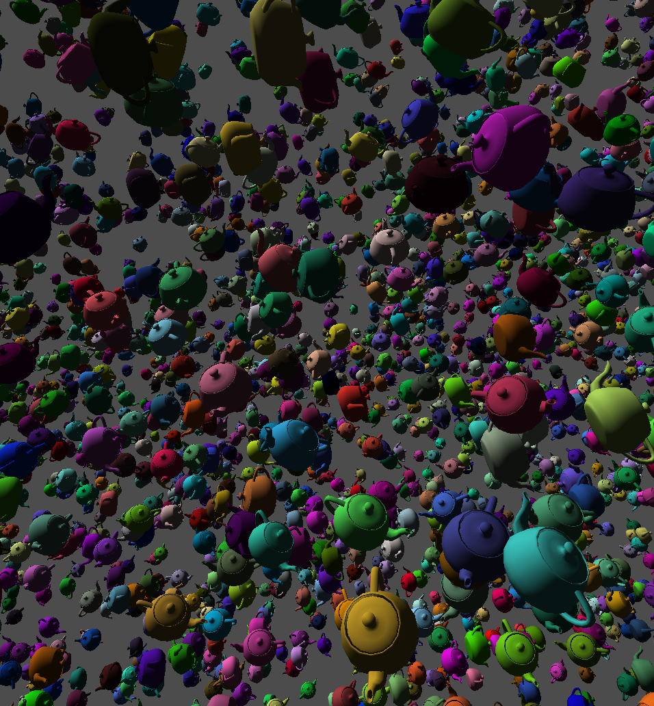

# Wingine

A Vulkan wrapper aiming to make graphics development in Vulkan somewhat enjoyable.

Previously, Wingine has been a part of [HConLib](https://github.com/TheVaffel/HConLib), but has been moved into its own project to ease sustained development.

A few examples of uses is in the `examples` folder. Here is a screenshot from the `instance_test` example, demonstrating instansted rendering:

It renders 20000 instances of the Utah teapot .obj model and uses simple Phong shading (diffuse light only). The color and offset of each teapot is given through per-instance attributes and its rotation is randomly generated on the host and accessed through a storage buffer. This example, including the shaders written in [spurv](https://github.com/TheVaffel/spurv), is about 200 lines of code.

Wingine is not considered finished (probably never will, which is common in the software world), but is considered somewhat usable it this point.
